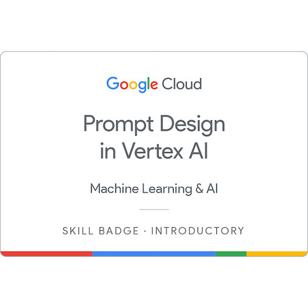
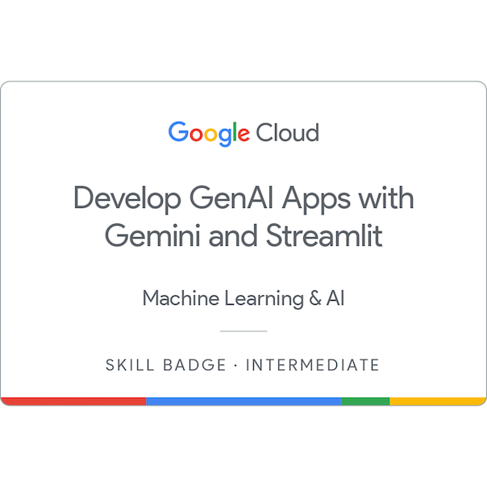
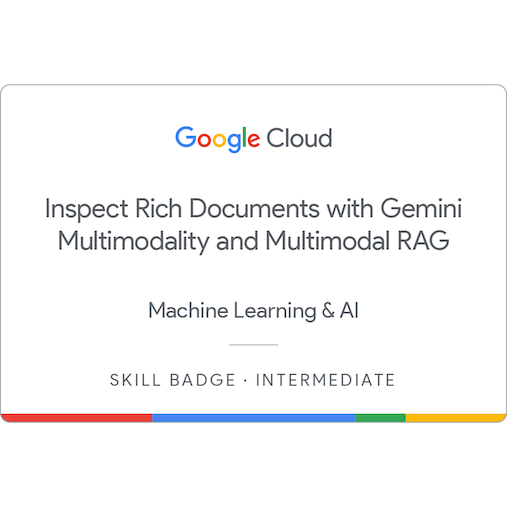

# Google Cloud Generative AI Coursework & Labs

Welcome to my repository for Google Cloud's Generative AI learning path! This collection serves as a portfolio of the skills and hands-on experience I've gained through various labs and courses focused on the Gemini API, Vertex AI, and other cutting-edge Google Cloud technologies.

---

## Google Cloud Skill Badges Earned

These badges represent the successful completion of hands-on labs and skill assessments on the Google Cloud platform.

| Badge | Skills Validated |
| :---: | --- |
|  | **Prompt Design in Vertex AI**: Crafting effective prompts for foundational models, designing prompts for different generative AI tasks (classification, summarization, extraction), and understanding advanced techniques like few-shot prompting. |
|  | **Build Real World AI Applications with Gemini and Imagen**: Using the Gemini and Imagen models on Vertex AI to build multimodal AI applications, integrating vision and language understanding, and generating images from text prompts. |
|  | **Develop GenAI Apps with Gemini and Streamlit**: Building and deploying interactive web applications powered by the Gemini API. Skills include creating user interfaces with Streamlit, handling API calls, and displaying generative content. |
|  | **Inspect Rich Documents with Gemini Multimodality and Multimodal RAG**: This skill badge validates your ability to leverage Gemini's multimodal capabilities and Retrieval-Augmented Generation (RAG) to extract insights from rich documents containing text, images, and video, and generate accurate, citation-backed answers. |

---

## Featured Labs & Coursework

This repository contains the code and notebooks from the labs I have completed.

### 1. Introduction to Function Calling with the Gemini API

* **File**: `intro_function_calling-v2.0.0.ipynb`
* **Description**: This lab explores the powerful function calling feature of the Gemini API. It demonstrates how to define functions within your code and have the Gemini model intelligently call them to retrieve information or interact with external systems, bridging the gap between natural language and structured APIs.

### 2. Getting Started with the Gemini API using cURL

* **File**: `intro_gemini_curl-v2.0.0 (1).ipynb`
* **Description**: This notebook provides a hands-on introduction to interacting with the Gemini API using cURL and REST API calls. It covers fundamental tasks such as text generation, multi-turn chat, multimodal input (text and images), and more, directly from the command line.

---

## Project Descriptions

This repository contains a series of hands-on projects that explore the multimodal capabilities of Google's Gemini models on Vertex AI. The projects cover foundational concepts, practical applications in retail, and advanced techniques like Retrieval-Augmented Generation (RAG) for rich documents.

---

### 1. Introduction to Multimodal Use Cases with Gemini

**File:** `intro_multimodal_use_cases-v2.0.0.ipynb`

This project serves as a fundamental introduction to working with multimodal inputs using the Gemini Pro Vision model. The primary goal was to understand how to combine text prompts with images and videos to perform a wide range of analysis tasks.

**Key Learnings & Activities:**

* **Image Understanding:** Performed tasks like object detection, getting image descriptions, and extracting information from complex visuals like user interface diagrams and charts.
* **Visual Comparisons:** Used Gemini to compare two images and identify similarities and differences, a key feature for recommendation systems and product analysis.
* **Video Analysis:** Processed video inputs to generate descriptions of the events occurring in the video, demonstrating the model's ability to understand temporal sequences.
* **Practical Application:** Worked with a "guess the landmark" example, where the model identified famous locations from images, showcasing its extensive knowledge base.

---

### 2. Multimodal Retail Recommendations

**File:** `multimodal_retail_recommendations-v2.0.0.ipynb`

This project applied the foundational knowledge of multimodality to a practical, real-world scenario: building a retail recommendation system. The objective was to create a system that could suggest products from a catalog based on a user's image.

**Key Learnings & Activities:**

* **Contextual Understanding:** Provided an image of a living room and prompted the model to suggest a suitable chair that would match the room's aesthetic.
* **Product Catalog Integration:** The model was given a set of product images (a catalog of chairs) and tasked with selecting the best match from the options provided.
* **JSON Output Formatting:** Learned to instruct the model to return its recommendation in a structured JSON format, which is crucial for integrating the AI's output with other applications or websites. This demonstrated how to make the model's output reliable and machine-readable.

---

### 3. Introduction to Multimodal Retrieval-Augmented Generation (RAG)

**File:** `intro_multimodal_rag-v2.0.0.ipynb`

This notebook explored an advanced AI technique: Multimodal Retrieval-Augmented Generation (RAG). The goal was to build a system that can answer questions by retrieving relevant information from a database containing both images and text, thereby grounding the model's responses in facts and reducing hallucinations.

**Key Learnings & Activities:**

* **Multimodal Embeddings:** Used the `multimodalembedding` model from Vertex AI to generate vector representations (embeddings) for both text descriptions and images of financial documents (Form 10-K).
* **Vector Search:** Stored these embeddings in a vector database and performed similarity searches to retrieve the most relevant text chunks and images based on a user's query.
* **Grounded Generation:** Fed the retrieved text and images as context to a Gemini model. This allowed the model to generate a well-informed answer to the user's question, complete with citations pointing back to the source documents. This process significantly improves the accuracy and trustworthiness of the generated responses.

---

### 4. Challenge Lab: Inspecting Rich Documents with Multimodal RAG

**File:** `inspect_rich_documents_w_gemini_multimodality_and_multimodal_rag-v1.0.0.ipynb`

This capstone project integrated all the skills learned from the previous notebooks into a comprehensive challenge. The objective was to build a complete end-to-end Multimodal RAG pipeline to analyze and answer questions about Google's 2023 10-K financial report, a document rich with text, tables, and charts.

**Key Learnings & Activities:**

* **End-to-End Pipeline:** Constructed a full system that involved:
    1.  **Parsing Documents:** Extracting text and images from a PDF document.
    2.  **Generating Embeddings:** Creating vector embeddings for all content.
    3.  **Indexing:** Storing the embeddings and their corresponding metadata.
    4.  **Retrieval:** Searching the index based on a user query to find relevant context.
    5.  **Generation:** Using Gemini Pro to generate a final, grounded answer based on the retrieved information.
* **Complex Document Analysis:** Successfully applied the RAG technique to a real-world, complex document, demonstrating the practical utility of this approach for industries like finance, research, and legal where deep document analysis is critical.
* **Problem Solving:** Overcame the challenges of handling mixed-media documents and ensuring that the final answers were accurate and directly supported by the provided source material.

Thank you for visiting!
